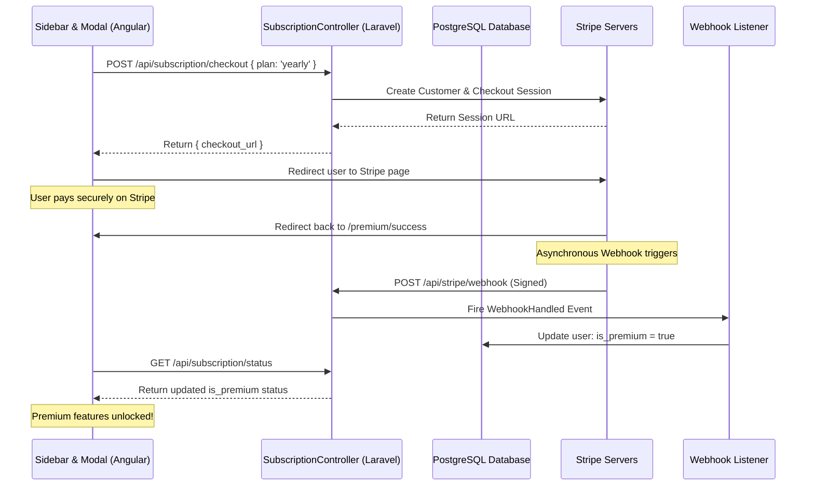

# How We Built the Stripe Subscription Billing System: Antigravity Explains

Hey! Grab a coffee. Here’s a breakdown of how we designed and built the Stripe subscription flow for **MightyInvest**. We’ll skip the textbook boilerplate and talk through the design decisions, the architecture, the roads we decided not to take, and why we built it this way.

---

## ☕ Step 1: The Approach & Starting Point

Our goal was to build a secure, robust subscription billing system that splits work cleanly between an **Angular 19 frontend** and a **Laravel 12 backend**.

Here was our starting point and reasoning:
1. **Security First**: We established that the backend must be the absolute source of truth. The frontend should never decide if a user is premium; it should only request a payment link and query the backend for status updates.
2. **Stripe Checkout over Stripe Elements**: We chose to redirect users to a Stripe-hosted checkout page rather than hosting credit card fields in our own UI. This immediately takes care of PCI-DSS compliance, handles multi-factor authentication (3D Secure), and works beautifully out of the box.
3. **Laravel Cashier**: Instead of writing raw Stripe SDK calls to create customers, subscriptions, and handle webhooks, we installed Laravel Cashier. Cashier handles the complex database mapping (subscriptions, items, customer IDs) automatically.

---

## 🚧 Step 2: The Roads Not Taken (And Why We Abandoned Them)

When designing this, we considered a few alternative approaches but rejected them:

* **Custom Frontend Card Forms (Stripe Elements / Stripe.js)**
  * *Why we rejected it:* Building forms directly in Angular means we have to handle card validation states, error messages, and complex loading sequences. It also increases security audit requirements (PCI compliance) because card details briefly touch our frontend runtime. Stripe Checkout handles all of this securely on Stripe's own servers.
* **Polling Stripe's API Directly on Redirect**
  * *Why we rejected it:* When a user completes a payment and lands back on our `/premium/success` page, we could technically call Stripe's API directly from the backend to verify the session. However, this is slow and synchronous. If the API call fails or times out, the user gets stuck. 
  * *What we did instead:* We set up an **asynchronous webhook listener** (`SyncPremiumStatus`) that waits for Stripe's server-to-server notifications. This guarantees that even if a user closes their browser tab immediately after paying, our database will still be updated.

---

## 🔗 Step 3: How the Pieces Connect

Here is how the frontend and backend interact during the payment lifecycle:

1. **Initiator (Sidebar)**: Clicking "Upgrade Now" sets `showPricingModal = true`.
2. **PricingModalComponent**: Renders Monthly/Yearly options. Clicking "Get Started" invokes the `PricingService`.
3. **PricingService**: Calls `POST /api/subscription/checkout`.
4. **SubscriptionController**: Validates the plan, fetches the respective Stripe Price ID from `config/services.php`, creates a new Stripe subscription checkout session via Cashier, and returns the Stripe checkout URL.
5. **Redirection**: The frontend redirects the user to Stripe.
6. **Webhook & Event Listener**: Once payment succeeds, Stripe notifies `/api/stripe/webhook`. Cashier receives it, verifies the signature, updates the database subscriptions tables, and fires `WebhookHandled`. 
7. **SyncPremiumStatus**: Listens to `WebhookHandled` and updates the main `users` table's `is_premium` column to `true`.

---

## 🛠️ Step 4: Tools & Technical Decisions

* **Angular Standalone Components**: We built `PricingModalComponent` as a standalone component using Angular 19. This keeps our modules decoupled and makes imports straightforward.
* **Tailwind & Glassmorphism CSS**: To make the modal feel premium and match the platform's dark theme, we used a semi-transparent dark backdrop overlay (`rgba(15, 17, 23, 0.85)`) coupled with a blurred container (`backdrop-filter: blur(25px)`). 
* **Tethering NGINX Proxy**: Our NGINX configuration routes `/api/*` to Laravel and all other paths to Angular. This prevents CORS issues entirely because both frontend and backend share the same hostname and port (`http://localhost:8085`).

---

## 🔄 Step 6: Checkout Landing Pages & Session Synchronization

When Stripe completes a payment session, it redirects the browser back to our frontend application:
* `/premium/success?session_id={CHECKOUT_SESSION_ID}` on success.
* `/premium/cancel` on cancellation.

Since Angular is a Single Page Application (SPA), we registered these custom routes inside `app.routes.ts` under the main dashboard layout.

### Success Landing Component (`PremiumSuccessComponent`)
To guarantee a smooth, instantaneous upgrade visual feedback loop, the success page:
1. Displays a premium centered glass card overlaying the dark layout.
2. Initiates a query-parameter reader to grab the `session_id`.
3. Starts a **Status Polling loop** (using RxJS `interval(2000)` running every 2 seconds, up to 15 times).
4. Calls our backend `/api/subscription/status` endpoint to check if Cashier's webhook signature processor has finished updating the user's local database row.
5. Once `is_premium` changes to `true`, it stops the polling loop, updates the UI to show a beautiful green checkmark, and triggers a call to `AuthService.fetchCurrentUser()` to reload the logged-in session so the sidebar and premium middleware refresh instantly.
6. Handles a fallback "processing" state gracefully if Stripe's webhook runs slower than 30 seconds.

### Cancel Landing Component (`PremiumCancelComponent`)
If the user cancels during checkout, they land on our cancellation component. This component displays an warning card indicating the checkout was canceled, assures the user that no charges were made, and provides a direct path back to the dashboard layout.

